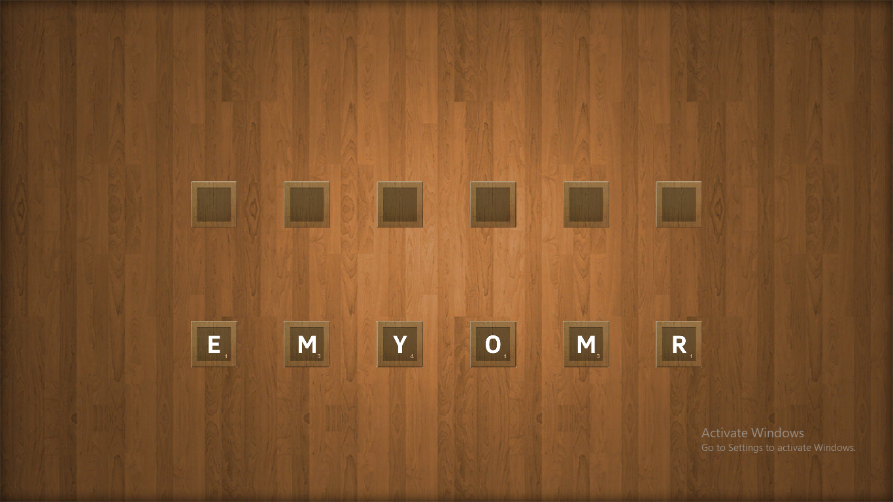

# Unity-Visual-Novel

For me and my girlfriend's anniversary, I coded a short Visual-Novel-like game in Unity. I created a script with special characters, commands, and syntax. I created a compiler for that in C#.

---
# Syntax

### Default setting

The interpreter reads the dialogue after the ':' and writes it letter by letter in a type-writer fasion. While the letters are being written, the text stops typing and immediately autofills the rest until a ``[``, ``]``, or until the end of the line.

``[`` means type letters and pause here. Another input would trigger the text writer to continue writing on the same line.

``]`` means type letters and pause here. Another input would trigger the text writer to continue writing on a new line.

**Default line syntax:**
``[Title]_[Sprite]_[Fade_Out]_[Fade_In]:<Message>``
``<Message>`` contains what is written in the text box. It could contain text that is <b>bold</b>, <i>italic</i>,<u>underlined</u>,as well as ``[`` or ``]`` modifiers.
Example:

    Unknown Caller_cellphone_0.1_0.2:On the path of the past[ Follow memories thou hast]For one you seek[ You will find them last

Here, "Unknown Caller is the title (person speaking)", "cellphone" is the name of the sprite to enter the view, "0.1" represents the time in seconds for the previous sprite to exit the scene while fading out, "0.2" represents the time in seconds for the "cellphone" sprite to enter the scene while fading in.

Output would be:

    On the path of the past(pause) Follow memories thou hast(pause)
    For one you seek(pause) You will find them last

Images:

---

### Commands

``+[Background Image Sprite]``: changes background image (scenery).

``--[Background Audio Clip]``: changes background music

``-[Sound Effect Clip]``: pauses background music, plays sound effect, resumes background music.

``~~[Title]:[Option]|[Offset]``: offers an unskippable pressable button as an option. If the button is pressed, skip Offset number of lines from the text being interpreted. Offset can be negative (to go back). Example:

``~[Title]:[Option 1]|[Offset 1]_[Option 2]|[Offset 2]``: offers two options as pressable buttons (like the above command but with actual choice here). If an option is pressed, skip its corresponding Offset number of lines from the text being interpreted. Offset can be negative (to go back).

``![Scene Number]{Parameter}``: loads new scene of *scene number* while keeping current scene. Temporarily disables all objects in the current scene. Offers any string as a ``Parameter`` for the next scene if needed.

---

# Minigames

#### Unscramble Minigame

Scene number 1. Takes the parameter as a string to scramble. Creates empty slots for every letter in the word. The slots are spaced out evenly horizontally stretching across the screen. Scrambled letters are also evenly spaced horizontally below the slots.

A letter can be "lifted"(includes shadow effect!) and dragged when pressed. When a letter "hovers above" a letter slot, the letter slot highlights. 

If the letter is released above a highlighted cell, the letter snaps onto the cell fitting it nicely. Once all letters are in place of their corresponding correct highlighted cells, all interaction is disabled, a "win" sound effect plays, and the scene exits.

#### Chess Tactic Minigame

I implemented a two player chess game. Then I modified it to implement tactics where the player is supposed to do a specific series of moves and the opponent moves accordingly.

All pieces are fully functional and highlight where they could go.

**After moving:**

